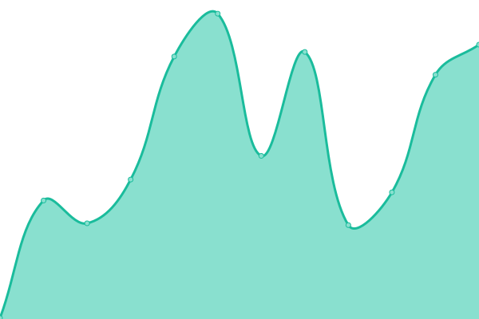
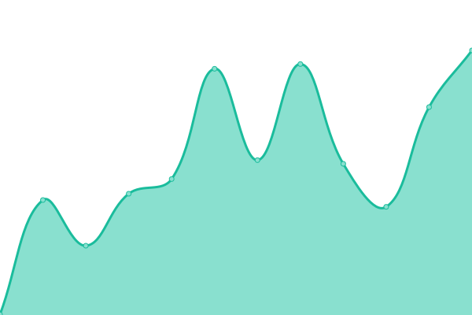

# [📈 Live Status](https://hcpss.github.io/upptime): <!--live status--> **🟩 All systems operational**

This repository contains the open-source uptime monitor and status page for [Howard County Public School System](http://www.hcpss.org), powered by [Upptime](https://github.com/upptime/upptime).

With [Upptime](https://upptime.js.org), you can get your own unlimited and free uptime monitor and status page, powered entirely by a GitHub repository. We use [Issues](https://github.com/hcpss/upptime/issues) as incident reports, [Actions](https://github.com/hcpss/upptime/actions) as uptime monitors, and [Pages](https://hcpss.github.io/upptime) for the status page.

<!--start: status pages-->
<!-- This summary is generated by Upptime (https://github.com/upptime/upptime) -->
<!-- Do not edit this manually, your changes will be overwritten -->
<!-- prettier-ignore -->
| URL | Status | History | Response Time | Uptime |
| --- | ------ | ------- | ------------- | ------ |
|  [hcpss.me](https://hcpss.me/) | 🟩 Up | [hcpss-me.yml](https://github.com/chadht/UpptimeSandbox/commits/HEAD/history/hcpss-me.yml) | 

 277ms
     
 | 

<a href="https://chadht.github.io/UpptimeSandbox/history/hcpss-me">100.00%</a>
    

|  [SSO](https://hcpss.me/saml/saml2/idp/metadata.php) | 🟩 Up | [sso.yml](https://github.com/chadht/UpptimeSandbox/commits/HEAD/history/sso.yml) | 

 62ms
     
 | 

<a href="https://chadht.github.io/UpptimeSandbox/history/sso">100.00%</a>
    

|  [Enhanced Security](https://hcpss.me/enhanced-security/script.js) | 🟩 Up | [enhanced-security.yml](https://github.com/chadht/UpptimeSandbox/commits/HEAD/history/enhanced-security.yml) | 

 34ms
     
 | 

<a href="https://chadht.github.io/UpptimeSandbox/history/enhanced-security">100.00%</a>
    

|  [www.hcpss.me](https://www.hcpss.me/) | 🟩 Up | [www-hcpss-me.yml](https://github.com/chadht/UpptimeSandbox/commits/HEAD/history/www-hcpss-me.yml) | 

 274ms
     
 | 

<a href="https://chadht.github.io/UpptimeSandbox/history/www-hcpss-me">100.00%</a>
    

|  [Minio](https://secminio.hcpss.org/public/status.xml) | 🟩 Up | [minio.yml](https://github.com/chadht/UpptimeSandbox/commits/HEAD/history/minio.yml) | 

 355ms
     
 | 

<a href="https://chadht.github.io/UpptimeSandbox/history/minio">100.00%</a>
    

|  [HCLibrary Cards](https://aplusstudent.hcpss.me/images/hclibrary.png) | 🟩 Up | [hc-library-cards.yml](https://github.com/chadht/UpptimeSandbox/commits/HEAD/history/hc-library-cards.yml) | 

 611ms
     
 | 

<a href="https://chadht.github.io/UpptimeSandbox/history/hc-library-cards">100.00%</a>
    

|  [Docker Registry](https://reg.hcpss.org/) | 🟩 Up | [docker-registry.yml](https://github.com/chadht/UpptimeSandbox/commits/HEAD/history/docker-registry.yml) | 

 313ms
     
 | 

<a href="https://chadht.github.io/UpptimeSandbox/history/docker-registry">100.00%</a>
    

|  [Student/Staff Account Management Web](https://sam.hcpss.org/) | 🟩 Up | [student-staff-account-management-web.yml](https://github.com/chadht/UpptimeSandbox/commits/HEAD/history/student-staff-account-management-web.yml) | 

 317ms
     
 | 

<a href="https://chadht.github.io/UpptimeSandbox/history/student-staff-account-management-web">100.00%</a>
    

|  [Student/Staff Account Management API](https://sam.hcpss.org/api/docs/) | 🟩 Up | [student-staff-account-management-api.yml](https://github.com/chadht/UpptimeSandbox/commits/HEAD/history/student-staff-account-management-api.yml) | 

 35ms
     
 | 

<a href="https://chadht.github.io/UpptimeSandbox/history/student-staff-account-management-api">100.00%</a>
    

|  [SSO JWT](https://sso-jwt.hcpss.org/sso-jwt/jwt.pub) | 🟩 Up | [sso-jwt.yml](https://github.com/chadht/UpptimeSandbox/commits/HEAD/history/sso-jwt.yml) | 

 278ms
     
 | 

<a href="https://chadht.github.io/UpptimeSandbox/history/sso-jwt">100.00%</a>
    

|  [Account Self-Service Web](https://account.hcpss.org/) | 🟩 Up | [account-self-service-web.yml](https://github.com/chadht/UpptimeSandbox/commits/HEAD/history/account-self-service-web.yml) | 

 257ms
     
 | 

<a href="https://chadht.github.io/UpptimeSandbox/history/account-self-service-web">100.00%</a>
    

|  [Account Self-Service API](https://account.hcpss.org/api/docs/) | 🟩 Up | [account-self-service-api.yml](https://github.com/chadht/UpptimeSandbox/commits/HEAD/history/account-self-service-api.yml) | 

 34ms
     
 | 

<a href="https://chadht.github.io/UpptimeSandbox/history/account-self-service-api">100.00%</a>
    

|  [LDAP API](https://ldapapi.hcpss.org/) | 🟩 Up | [ldap-api.yml](https://github.com/chadht/UpptimeSandbox/commits/HEAD/history/ldap-api.yml) | 

 332ms
     
 | 

<a href="https://chadht.github.io/UpptimeSandbox/history/ldap-api">100.00%</a>
    

|  [Password API](https://passwordapi.hcpss.org/) | 🟩 Up | [password-api.yml](https://github.com/chadht/UpptimeSandbox/commits/HEAD/history/password-api.yml) | 

 317ms
     
 | 

<a href="https://chadht.github.io/UpptimeSandbox/history/password-api">100.00%</a>
    

|  [SMTP API](https://smtpapi.hcpss.org/) | 🟩 Up | [smtp-api.yml](https://github.com/chadht/UpptimeSandbox/commits/HEAD/history/smtp-api.yml) | 

 308ms
     
 | 

<a href="https://chadht.github.io/UpptimeSandbox/history/smtp-api">100.00%</a>
    

|  [IP Info](https://ipinfo.hcpss.org/) | 🟩 Up | [ip-info.yml](https://github.com/chadht/UpptimeSandbox/commits/HEAD/history/ip-info.yml) | 

 365ms
     
 | 

<a href="https://chadht.github.io/UpptimeSandbox/history/ip-info">100.00%</a>
    

|  [WireGuard](https://wgapi.hcpss.org/api/docs/) | 🟩 Up | [wire-guard.yml](https://github.com/chadht/UpptimeSandbox/commits/HEAD/history/wire-guard.yml) | 

 258ms
     
 | 

<a href="https://chadht.github.io/UpptimeSandbox/history/wire-guard">100.00%</a>
    

|  [MeshCentral](https://meshcentral.hcpss.org/) | 🟩 Up | [mesh-central.yml](https://github.com/chadht/UpptimeSandbox/commits/HEAD/history/mesh-central.yml) | 

 330ms
     
 | 

<a href="https://chadht.github.io/UpptimeSandbox/history/mesh-central">100.00%</a>
    

|  [Chromebook API](https://chromebookapi.hcpss.org/) | 🟩 Up | [chromebook-api.yml](https://github.com/chadht/UpptimeSandbox/commits/HEAD/history/chromebook-api.yml) | 

 305ms
     
 | 

<a href="https://chadht.github.io/UpptimeSandbox/history/chromebook-api">100.00%</a>
    

|  [Canvas API](https://canvasapi.hcpss.org/) | 🟩 Up | [canvas-api.yml](https://github.com/chadht/UpptimeSandbox/commits/HEAD/history/canvas-api.yml) | 

 283ms
     
 | 

<a href="https://chadht.github.io/UpptimeSandbox/history/canvas-api">100.00%</a>
    

|  [SaltProject API](https://saltapi.hcpss.org/) | 🟩 Up | [salt-project-api.yml](https://github.com/chadht/UpptimeSandbox/commits/HEAD/history/salt-project-api.yml) | 

 202ms
     
 | 

<a href="https://chadht.github.io/UpptimeSandbox/history/salt-project-api">100.00%</a>
    

|  [Borg](https://borg.hcpss.org/) | 🟩 Up | [borg.yml](https://github.com/chadht/UpptimeSandbox/commits/HEAD/history/borg.yml) | 

 211ms
     
 | 

<a href="https://chadht.github.io/UpptimeSandbox/history/borg">100.00%</a>
    

|  [Send](https://send.hcpss.org/) | 🟩 Up | [send.yml](https://github.com/chadht/UpptimeSandbox/commits/HEAD/history/send.yml) | 

 606ms
     
 | 

<a href="https://chadht.github.io/UpptimeSandbox/history/send">100.00%</a>
    

|  [PWPush](https://pwpush.hcpss.org/) | 🟩 Up | [pw-push.yml](https://github.com/chadht/UpptimeSandbox/commits/HEAD/history/pw-push.yml) | 

 339ms
     
 | 

<a href="https://chadht.github.io/UpptimeSandbox/history/pw-push">100.00%</a>
    

|  [PWGen](https://pwgen.hcpss.org/) | 🟩 Up | [pw-gen.yml](https://github.com/chadht/UpptimeSandbox/commits/HEAD/history/pw-gen.yml) | 

 222ms
     
 | 

<a href="https://chadht.github.io/UpptimeSandbox/history/pw-gen">100.00%</a>
    

|  [Service Requet (API)](https://srapi.hcpss.org/api/auth/login) | 🟩 Up | [service-requet-api.yml](https://github.com/chadht/UpptimeSandbox/commits/HEAD/history/service-requet-api.yml) | 

 249ms
     
 | 

<a href="https://chadht.github.io/UpptimeSandbox/history/service-requet-api">100.00%</a>
    

|  [Service Request (Web)](https://sr.hcpss.org/app/css/styles.css) | 🟩 Up | [service-request-web.yml](https://github.com/chadht/UpptimeSandbox/commits/HEAD/history/service-request-web.yml) | 

 287ms
     
 | 

<a href="https://chadht.github.io/UpptimeSandbox/history/service-request-web">100.00%</a>
    

|  [CO MTA](coamta.hcpss.org) | 🟩 Up | [co-mta.yml](https://github.com/chadht/UpptimeSandbox/commits/HEAD/history/co-mta.yml) | 

 28ms
     
 | 

<a href="https://chadht.github.io/UpptimeSandbox/history/co-mta">100.00%</a>
    

|  [AO MTA](aoamta.hcpss.org) | 🟩 Up | [ao-mta.yml](https://github.com/chadht/UpptimeSandbox/commits/HEAD/history/ao-mta.yml) | 

 29ms
     
 | 

<a href="https://chadht.github.io/UpptimeSandbox/history/ao-mta">100.00%</a>
    

<!--end: status pages-->

[**Visit our status website →**](https://hcpss.github.io/upptime)

## 📄 License

- Powered by: [Upptime](https://github.com/upptime/upptime)
- Code: [MIT](./LICENSE) © [Howard County Public School System](http://www.hcpss.org)
- Data in the `./history` directory: [Open Database License](https://opendatacommons.org/licenses/odbl/1-0/)
